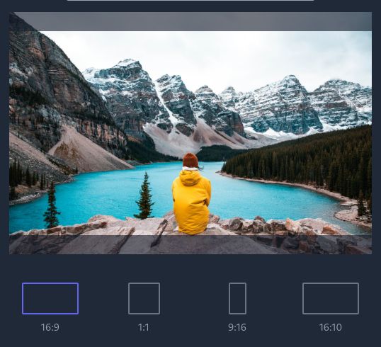

# React dimension select

A minimal dimension selector using react hooks

<p align="center">
  
</p>

## Install

```bash
npm i react-dimension-select
```

## How to use

### Example code:

```tsx
import React from 'react'

import classNames from 'classnames'
import { DimensionPreview, useDimensionsSelect, DimensionsOptions, DimensionsSelector } from 'react-dimension-select'

const defaultImage =
  'https://images.unsplash.com/photo-1602826347632-fc49a8675be6?ixid=MnwxMjA3fDB8MHxwaG90by1wYWdlfHx8fGVufDB8fHx8&ixlib=rb-1.2.1&auto=format&fit=crop&w=1350&q=80'

// The options available to select
const dimensionsOptions: DimensionsOptions = [
  {
    // Name of the option
    name: '16:9',
    // The final dimension in px
    dimensions: [1920, 1080],
    // This gets the width and height of the current preview
    // and returns what height and width the preview should be
    getPreviewDimensions: ({ width }) => ({
      width,
      height: width / 1.7777777777777777
    }),
    // Icon to show
    icon: (selected) => (
      <div
        className={classNames(
          'border-2  group-hover:border-indigo-500 rounded-sm w-20 h-[45px]',
          selected ? 'border-indigo-500' : 'border-gray-500'
        )}
      />
    )
  },
  {
    name: '1:1',
    dimensions: [1080, 1080],
    getPreviewDimensions: ({ height }) => ({
      height,
      width: height
    }),
    icon: (selected) => (
      <div
        className={classNames(
          'border-2  group-hover:border-indigo-500 rounded-sm  w-[45px] h-[45px]',
          selected ? 'border-indigo-500' : 'border-gray-500'
        )}
      />
    )
  },
]

function App() {
  const { previewProps, selectorProps } = useDimensionsSelect(dimensionsOptions)

  return (
    <div className="w-full flex flex-col min-h-screen justify-center items-center bg-gray-800 text-white">
      <div className="mt-2 mx-auto grid items-center py-2 justify-center h-full w-full max-w-lg">
        <DimensionPreview image={defaultImage} {...previewProps} />
      </div>

      <DimensionsSelector {...selectorProps} />

      <div className='mt-3'>
        Selected Option: {selectedOption.name}, Dimensions: {selectedOption.dimensions.join('x')}
      </div>
    </div>
  )
}

export default App
```

### The components:

- `useDimensionsSelect` hook:
  
  This hook takes in dimension options like
  ```ts
  const dimensionsOptions: DimensionsOptions = [
    {
      name: '16:9',
      dimensions: [1920, 1080],
      getPreviewDimensions: ({ width }) => ({
        width,
        height: width / 1.7777777777777777
      }),
      icon: (selected) => (
        <div
          className={classNames(
            'border-2 w-20 h-[45px]',
            selected ? 'border-indigo-500' : 'border-gray-500'
          )}
        />
      )
    },
  ]
  ```
  and returns the following:
  ```ts
  {
    // Currently selected option
    selectedOption,
    // Index of currently selected option
    selectedIndex,
    // A function to select an option, take in the option's index
    // eg: setSelectedIndex(1)
    setSelectedIndex,
    // A function to set the option which is being hovered or is to be previewed
    // eg: setHoveringIndex(1) or setHoveringIndex(null)
    setHoveringIndex,
    // Index of option currently being hovered
    hoveringIndex,
    // This object can directly be passed to DimensionsSelector
    // eg: <DimensionsSelector {...selectorProps} />
    selectorProps: { ... },
    // This object can directly be passed to DimensionPreview
    // eg: <DimensionPreview {...previewProps} />
    previewProps: { ... }
  }
  ```
